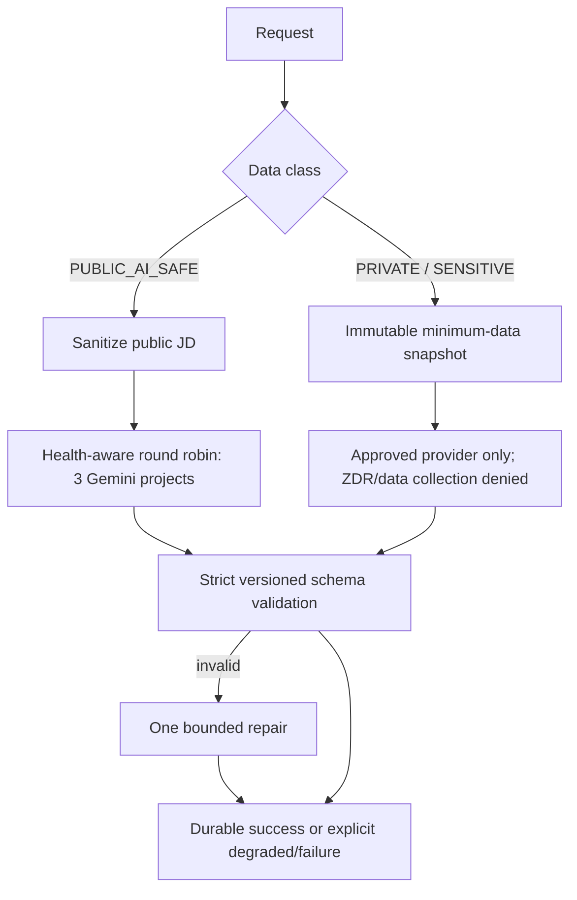

# AI pipeline

Business services request a task, capability, and classification; provider selection stays in the orchestrators. Private data never falls back to the public pool. Operations store provider/model provenance, token counts, latency, cache state, estimated cost, result, and correlation ID—never private prompts or response bodies. `JobDemandProfile` is the reusable structured interpretation of a JD. AI may suggest personal-state changes but cannot silently apply them or invent facts.
