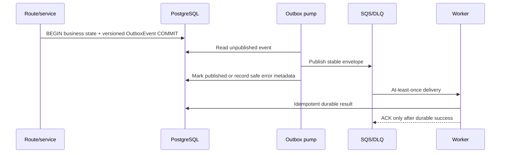

# Async processing

Envelopes carry `event_id`, `event_type`, `schema_version`, `occurred_at`, `correlation_id`, and a minimal payload. Workers reject unsupported versions, return SQS partial-batch failures, and rely on durable idempotency keys. Queue redrive is five attempts; DLQ and queue-age alarms are Terraform-managed. Shared public fetches use a normalized adapter/URL key, a short lease, and a five-minute result cache without storing Watch intent.
