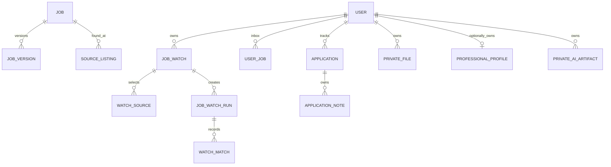

# Data model and classification

Public canonical jobs and versions are shared; tenant-owned Inbox state, Watches, applications, notes, Profile, CVs, pasted JDs, artifacts, exports, and deletion workflows are private. Foreign-key cascades are limited to unquestionably owned children. User deletion never cascades into shared Jobs. Explicit private deletion hard-deletes active content and removes private objects; archive states are used only for intentional lifecycle history.
