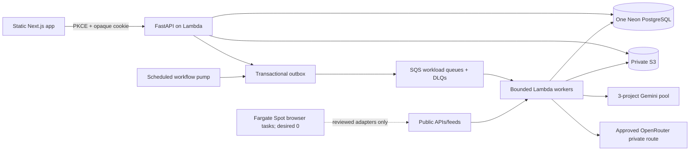

# System overview

The frontend is a secret-free static export served from S3 through CloudFront OAC. API Gateway HTTP API invokes one modular FastAPI Lambda. Business state, operational controls, audit, workflow state, and the outbox share exactly one PostgreSQL database while remaining separated by modules and service/repository boundaries.

Important DB-to-queue transitions commit business state and an outbox event together. A minute scheduler enqueues due Watches and publishes unpublished envelopes. Each queue maps to a workload-aware Lambda with partial-batch failure responses and bounded concurrency. Browser work has no always-on service and no P0 launch adapter currently requires it.

See `async-processing.md`, `data-model.md`, `ai-pipeline.md`, `security-boundaries.md`, and `s3-data-layout.md` for boundary details.
